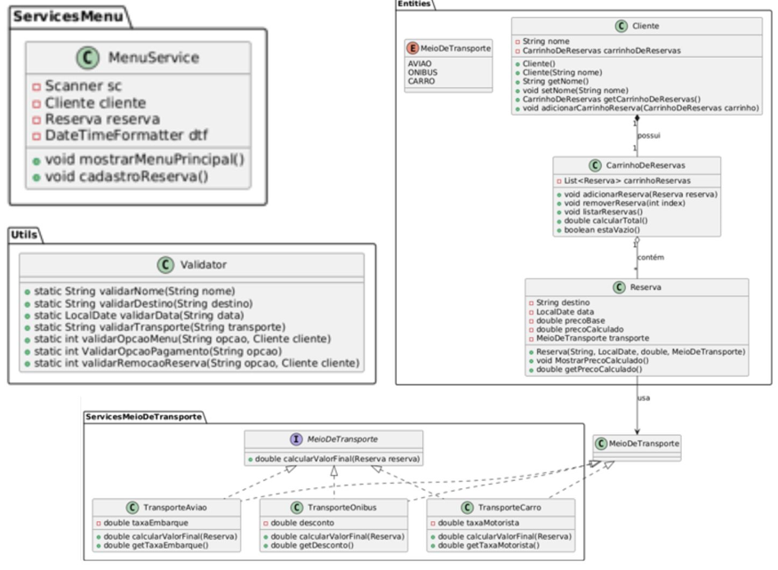
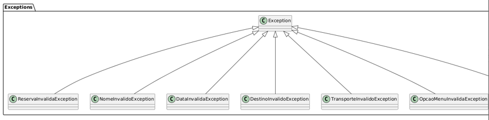

# ✈️ Sistema de Reservas de Viagem


Projeto Java orientado a objetos para **gerenciar reservas de viagens**, com carrinho de reservas, múltiplas formas de pagamento, validações robustas e arquitetura por camadas. 💼

---

## 📚 Funcionalidades

✔️ Cadastro de cliente e reservas  
✔️ Validação de entradas com tratamento de exceções personalizadas  
✔️ Cálculo de preço com diferentes meios de transporte  
✔️ Pagamento via Pix ou Cartão (com desconto ou taxa)  
✔️ Estrutura organizada em camadas: `Entities`, `Services`, `Utils`, `Validators`, `Exceptions`  
✔️ Interação via console com menu amigável

---

## 🧠 Tecnologias usadas

- ☕ **Java 17**
- 🧱 **Paradigma OOP (POO)** completo
- 📦 Estrutura modular por pacotes
- 🧪 Tratamento de exceções customizadas
- 📃 PlantUML (para documentação)

---

## 🧩 Estrutura do Projeto

```
src/
├── Entities/
│   ├── Cliente.java
│   ├── Reserva.java
│   └── CarrinhoDeReservas.java
├── ServicesMenu/
│   └── MenuService.java
├── ServicesMetodoPagamento/
│   └── MetodoPagamento + Implementações
├── ServicesMeioDeTransporte/
│   └── MeioDeTransporte + Implementações
├── Utils/
│   ├── Validator.java
│   └── ConsoleUtils.java
└── Exceptions/
    └── Todas as exceções personalizadas
```
---

## 🗂️ Diagrama de Classes UML

Representação da arquitetura de classes com relacionamentos, interfaces e pacotes:

<p align="center">
  
</p>

<p align="center">
  
</p>

---

## ⚙️ Como executar

```bash
1. Clone o repositório:
   git clone https://github.com/richarddherrera/java-travel-reservation

2. Abra no Eclipse ou IntelliJ

3. Rode a classe principal (MenuService ou Main)

4. Interaja pelo console 😄

========== MENU DE RESERVAS ==========
1 - Ver carrinho de reservas
2 - Adicionar nova reserva
3 - Remover reserva do carrinho
4 - Finalizar compra
0 - Sair          
````

## 👨‍💻 Autor 
Desenvolvido por Richard Herrera Gomes 💻
